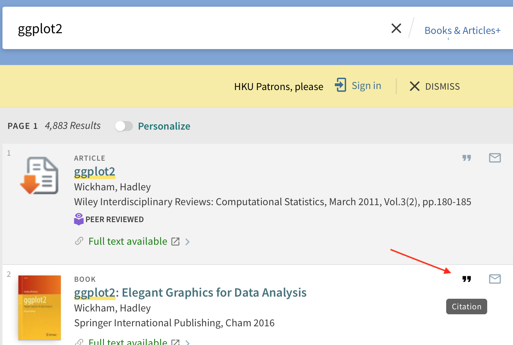
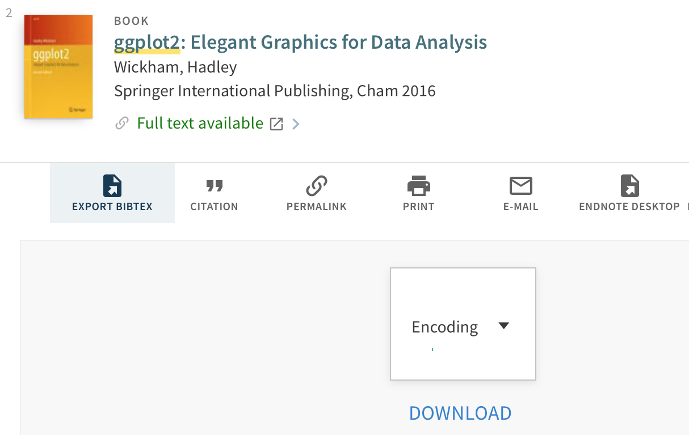

# Instructions
The file 'Proposal.Rmd' is where we will write the project

# Citing
To cite, I suggest we use the bibtex citation. It's pretty neat because it automatically renders the references in the end of the document. All we need to do is write "@lastnameYYYY" in the text where we want to reference someone, (change "lastname" to the last name of the author, and "YYYY" to the year the article/book was published.) We connect these commands to commands in the .bib file "bibliography.bib".

So once you've found an article you want to cite. First follow these steps, and then all you need to do is write "@lastnameYYYY" in the text in the proposal, and the article/book will automatically be included in the references.

 

#### Example
Go to [lib.hku.hk](http://lib.hku.hk) and search for the article/book. Let's say I want to cite Hadley Wickham's book on ggplot2. Find it and press the Citation mark.

   
Select "EXPORT BIBTEX" and then "DOWNLOAD"
  

  

You will see the following.
  

  

Copy the whole text and paste it in the .bib file. The first line of text right after "@book{" is just the command we use in the text when citing. To open the .bib file I use TeXShop but you can use whatever you want. You can it with brackets or any other text editor i think.

The only change you should make is the default command "WickhamHadley2016gEGf". This is 100 % arbitrary but I suggest we use "lastnameYYYY" because it's easy to remember.

  

  

Save, and once you've saved you can write "@wickham2016" in the .Rmd file. I've already included this and 3 other books and articles (as you can see above). 